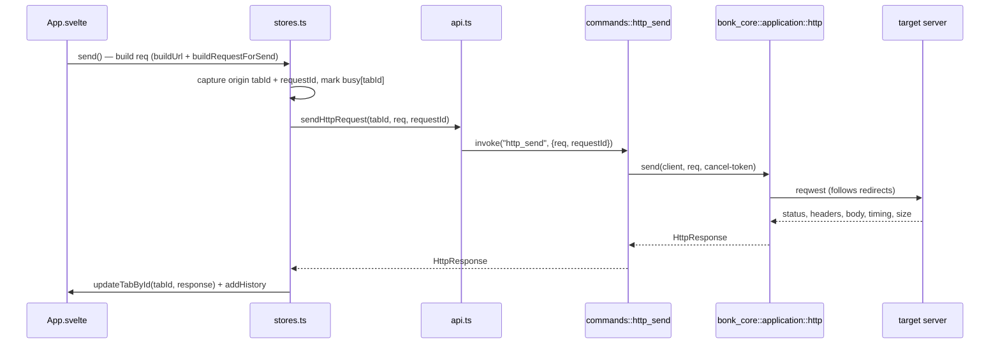

# Architecture

Bonk is a local-first desktop API client (HTTP + gRPC). It is split into three
layers with a deliberately thin boundary between them:

- **`src/`** — Svelte 5 UI (view + thin view-state).
- **`src-tauri/`** — Tauri shell: `#[tauri::command]` wrappers, app state, the
  native folder dialog. Owns no business logic.
- **`crates/bonk-core/`** — Tauri-independent Rust core: all HTTP/gRPC/workspace/
  state logic. Buildable and testable without a webview (`cargo test -p bonk-core`).

```
┌─────────────────────────────────────────────────────────────────┐
│  src/  — Svelte 5 (WKWebView)                                     │
│                                                                   │
│  App.svelte ── stores.ts (tabs, collections, history, settings)  │
│       │            │                                              │
│       │            ├── api.ts        (invoke wrappers)            │
│       │            └── persist.ts    (invoke wrappers)            │
│       │            domain/: types, tree, http, curl, grpc, method │
└───────┼───────────────────────────────────────────────────────────┘
        │  Tauri IPC  (invoke "command", JSON args/results)
┌───────▼───────────────────────────────────────────────────────────┐
│  src-tauri/  — Tauri shell (thin)                                  │
│                                                                    │
│  commands/mod.rs   #[tauri::command] fns → call bonk_core          │
│  state.rs          AppState { http_client, conns, cancels }        │
│  lib.rs            Builder + generate_handler!  ·  pick_folder(rfd) │
└───────┬───────────────────────────────────────────────────────────┘
        │  plain Rust calls (bonk_core::…)
┌───────▼───────────────────────────────────────────────────────────┐
│  crates/bonk-core/  — pure core (no tauri, no rfd)                 │
│                                                                    │
│  application/  http · grpc_native · workspace · app_state          │
│  domain/       http · grpc · grpc_parse · url · workspace (types)  │
│  infra/        reqwest_client                                      │
│  conn.rs       GrpcConn, GrpcDescriptorCache                       │
└───────┬───────────────────────────────┬───────────────────────────┘
        │ reqwest / tonic                │ std::fs
┌───────▼────────────┐         ┌─────────▼─────────────────────────┐
│ HTTP / gRPC servers │         │ Disk: workspace folder + state.json│
└────────────────────┘         └───────────────────────────────────┘
```

## Tauri commands (the IPC surface)

`src-tauri/src/lib.rs` registers exactly these; each is a thin wrapper over
`bonk-core` (except `workspace_pick_folder`, which is the shell-side rfd dialog):

| Area | Commands |
| --- | --- |
| HTTP | `http_send`, `cancel_request` |
| gRPC | `grpc_connect`, `grpc_reflect`, `grpc_template`, `grpc_call` |
| Workspace | `workspace_pick_folder`, `workspace_load`, `workspace_create_folder`, `workspace_save_request`, `workspace_rename`, `workspace_delete`, `workspace_duplicate`, `workspace_move` |
| App state | `app_state_load`, `app_state_set` |

Frontend bindings live in `src/lib/api.ts` (workspace/http/gRPC) and
`src/lib/persist.ts` (app state).

## HTTP request flow



- In-flight state is **per tab** (`busy[tabId]`); the response is written back to
  the tab it was sent from, even if the user switched tabs.
- Cancel: `cancel_request` resolves a `oneshot` in `AppState.cancels`, aborting
  the in-flight reqwest.

## gRPC flow

`grpc_connect` opens a tonic channel (cached in `AppState.conns` keyed by a
connection id) → `grpc_reflect` pulls the service tree via server reflection →
`grpc_template` builds an example JSON message for a method → `grpc_call` invokes
it with metadata. Reflection descriptors are cached in `GrpcDescriptorCache`.
Runtime-only fields (`connectionId`, `tree`) are stripped before a request is
persisted, so a stale connection can't block reconnect after restart.

## Persistence — two stores, both owned by Rust

**1. Workspace = filesystem-as-truth.** When a workspace folder is open, the
directory tree *is* the data:

```
my-workspace/
├── Auth/                     ← folder  (FolderNode, id "fs:Auth")
│   ├── Login.bonk.json       ← request (RequestNode, id "fs:Auth/Login.bonk.json")
│   └── Refresh.bonk.json
└── Health.bonk.json
```

`workspace_load` walks it recursively into a `TreeNode[]` (folders first, then
requests, each alphabetical). Mutations are granular fs ops
(create/save/rename/delete/duplicate/move) — there is **no manifest**, which is
what keeps it Git-friendly and self-healing. Node id = `fs:<relative path>`.

**2. App state = `state.json` KV** (in the app data dir), via `app_state_load` /
`app_state_set`. Holds session/UI state: open `tabs`, `history`, `workspacePath`,
and settings (`historyLimit`, `historyPaused`, `sidebarWidth`, `responseHeight`).
Writes are atomic (temp file + rename) and serialized by a process-wide lock;
a corrupt file degrades to empty instead of wedging. One-time migration reads the
legacy `bonk.json` (old `@tauri-apps/plugin-store` file) if `state.json` is absent.

## Core data types

- **`TreeNode = FolderNode | RequestNode`** (`domain/workspace.rs`, mirrored in
  `src/lib/domain/types.ts`) — discriminated by `kind`. On disk a request is a
  `RequestFile` (no id/kind; name is authoritative, filename is derived).
- **`Tab`** (`src/lib/domain/types.ts`) — a frontend session tab: protocol, the
  live `HttpRequest`/`GrpcTabState`, optional `savedPath` linking it to a file,
  and the last `response`. Never persisted to the workspace; only to `state.json`.

## Why this shape

- **Core is independent.** `bonk-core` has no `tauri`/`rfd` dep, so the logic is
  unit-testable headless and reusable (a CLI or another frontend could link it).
- **Shell is thin.** `src-tauri` only marshals IPC and owns runtime handles
  (reqwest client, gRPC connections, cancel channels).
- **View is replaceable.** Svelte holds presentation + view-state; all I/O,
  persistence, and protocol logic live behind the command boundary in Rust.
