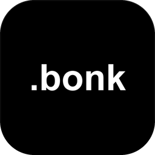
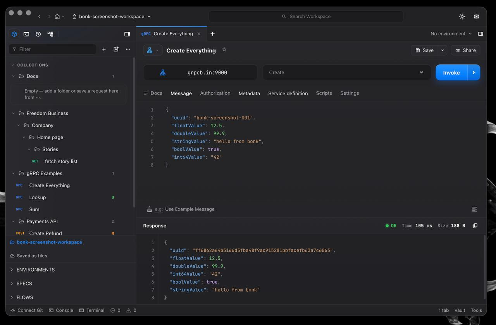
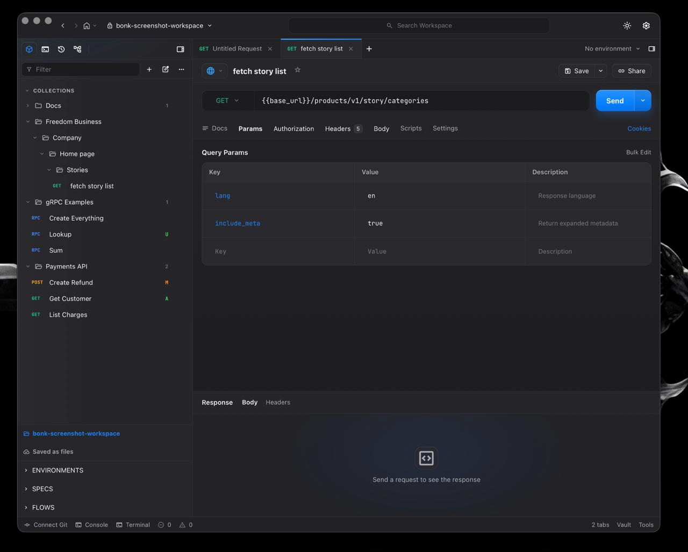
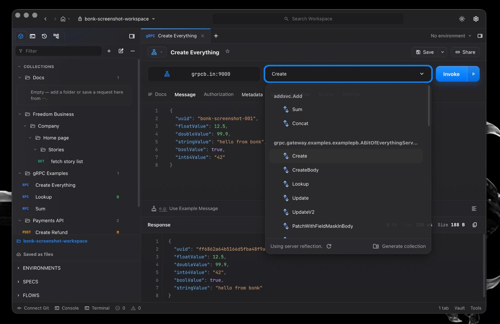
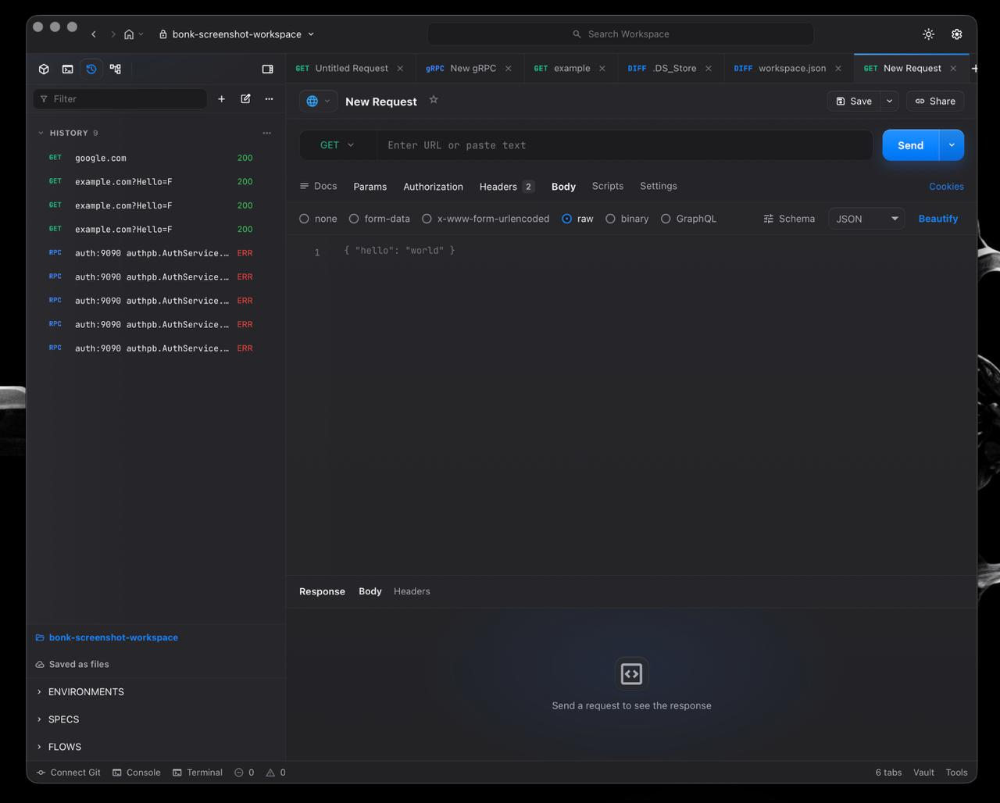

<div align="center">



# bonk

**Local-first desktop API client for HTTP &amp; gRPC.**
Built in **Rust** — native, not Electron. Git-first, offline, and **~10× lighter** than Electron API clients.

[](https://github.com/nekidaz/.bonk/actions/workflows/ci.yml)
[](https://github.com/nekidaz/.bonk/releases/latest)
[](https://github.com/nekidaz/.bonk/releases)
[](LICENSE)
[](https://www.rust-lang.org/)


[**Website**](https://nekidaz.github.io/.bonk/) · [**Download**](https://github.com/nekidaz/.bonk/releases/latest) · [Features](#-features) · [Install](#-install) · [Screenshots](#-screenshots) · [Architecture](#-architecture)

</div>



bonk is a desktop API client built with Tauri, Svelte, TypeScript, and Rust.
Requests are stored as plain files in a workspace folder, so collections are
easy to review, diff, and commit — there is no hidden database and nothing is
sent to the cloud.

## ⚡ Why bonk?

The backend is **Rust** (via Tauri), rendered through the OS-native WebView — no
bundled Chromium, no 400 MB Electron runtime. The result is a tiny, fast,
do-one-thing-well API client that idles at basically zero.

| | **bonk** (Rust/Tauri) | Electron clients (Postman, Insomnia) |
| --- | --- | --- |
| RAM (idle) | **~37 MB** | ~400–700 MB |
| Download size | **~7 MB** | ~200 MB – 1 GB |
| Idle CPU | **~0%** | noticeable |
| Engine | Rust + native WebView | bundled Chromium + Node |
| Account / cloud | **none — local-first** | account, cloud sync |
| Collections | **plain files (git-diffable)** | proprietary DB / cloud |

> Numbers for bonk are measured on a release build; Electron figures are typical
> ranges for those apps. Roughly **10× lighter** on memory, and orders of
> magnitude smaller to download.

## ✨ Features

- ⚡ **HTTP** — method, URL, query params, headers, body (raw/JSON, form-data,
  url-encoded, binary, GraphQL), redirects, timing, response size, cancellation,
  and pretty/raw/preview responses.
- 🔌 **gRPC** — native server reflection, method picker, example message
  templates, metadata, cancellation, and formatted responses.
- 🗂️ **File-based workspaces** — the directory tree on disk *is* the workspace
  (folder = directory, request = `*.bonk.json`). Nested folders, no manifest.
- 🌿 **Git-first source control** — a built-in panel and a single **Project
  Diff** tab: stage / unstage / discard per file and commit, status badges on
  the collection tree, branch switch/create, pull/push, and a commit log — all
  on your system `git`.
- 💾 **Smart Save** (⌘S) — updates the backing file in place, or asks where to
  put a new request.
- 🕘 **Request history** — configurable limit, pause, and one-click reopen.
- 📥 **cURL import** — paste a `curl` command, get a request.
- 🔄 **Auto-updates** — the app checks for a newer signed release and installs it
  in place.
- 🌑 **Offline & themed** — fonts vendored (no CDN), Big Sur-inspired UI with
  light and dark themes.

## 📦 Install

Download the latest build from [**Releases**](https://github.com/nekidaz/.bonk/releases/latest).

### macOS

```sh
# Homebrew (recommended)
brew install --cask nekidaz/tap/bonk
```

…or grab the Apple Silicon **`.dmg`** (arm64). Builds are **unsigned** by Apple, so on first
launch right-click the app → **Open** to get past Gatekeeper (the Homebrew cask
clears the quarantine flag for you).

### Windows

```powershell
# Chocolatey
choco install bonk
```

The Chocolatey command is the intended public install path once the package is
published. Until then, download the Windows installer from
[Releases](https://github.com/nekidaz/.bonk/releases/latest).

### Linux

```sh
# AppImage
chmod +x bonk_*.AppImage && ./bonk_*.AppImage

# Debian / Ubuntu
sudo apt install ./bonk_*.deb
```

### Updates

bonk updates itself: it checks for a newer **signed** release on launch and
shows an **Update available** prompt — one click downloads, installs, and
relaunches. You can also trigger it from **Settings → Check for updates**.
Homebrew users can `brew upgrade --cask bonk`; Chocolatey users can
`choco upgrade bonk` after the package is published.

## 🖼️ Screenshots

| HTTP | gRPC (server reflection) |
| --- | --- |
|  |  |

History, multiple tabs, and the Git diff view:



## 🛠️ Tech Stack

- **Tauri 2** — native shell
- **Svelte 5** + **TypeScript** — UI
- **Rust** — core logic (`reqwest` for HTTP, `tonic` / `prost-reflect` for gRPC)

## 🏗️ Architecture

Three layers: a Svelte UI, a thin Tauri shell, and a Tauri-independent Rust core
(`crates/bonk-core`). See [ARCHITECTURE.md](ARCHITECTURE.md) for diagrams of the
layers, the IPC command surface, the HTTP/gRPC request flows, and persistence.

## 💻 Development

Prerequisites: Node 20+, Rust (stable), and the
[Tauri 2 system dependencies](https://v2.tauri.app/start/prerequisites/).

```sh
git clone https://github.com/nekidaz/.bonk.git
cd .bonk
npm ci
npm run tauri dev      # run the full app
```

`npm run dev` serves the web frontend alone (handy for visual work), but Tauri
APIs — native commands, the local store, git — only work inside the Tauri
runtime.

### Checks

```sh
npm run check
npm test
npm run build
cargo test --manifest-path src-tauri/Cargo.toml
cargo clippy --workspace --all-targets -- -D warnings
```

## 📁 Workspace Files

When you open a workspace folder, bonk stores it as plain files on disk: each
folder is a directory and each saved request is a `*.bonk.json` file. Folders
nest to any depth and mirror the sidebar tree. There is no hidden manifest — the
directory layout *is* the workspace, which keeps it Git-friendly and
human-reviewable.

## 🤝 Contributing

See [CONTRIBUTING.md](CONTRIBUTING.md). Maintainers: [RELEASING.md](RELEASING.md)
covers how to cut a release. Changes are tracked in [CHANGELOG.md](CHANGELOG.md).

## 📄 License

[MIT](LICENSE).
