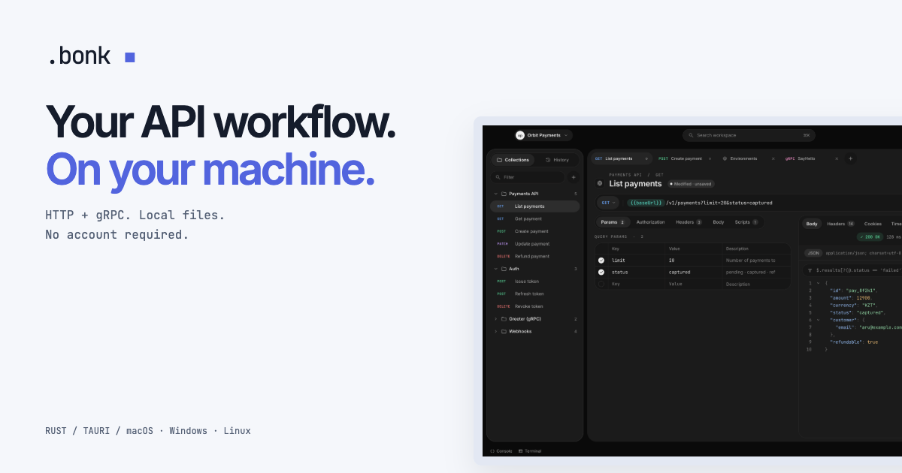
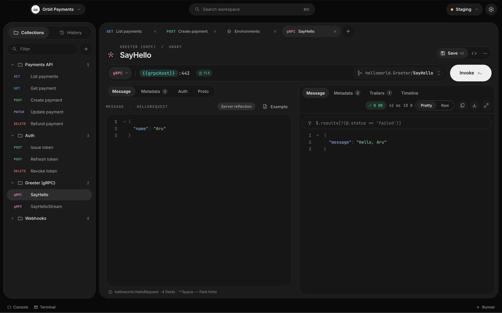
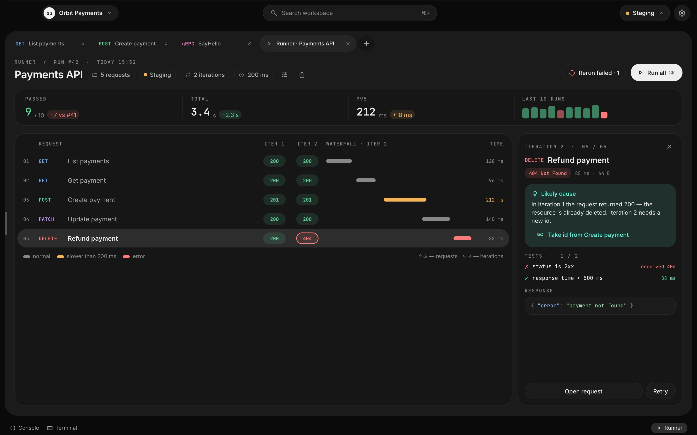
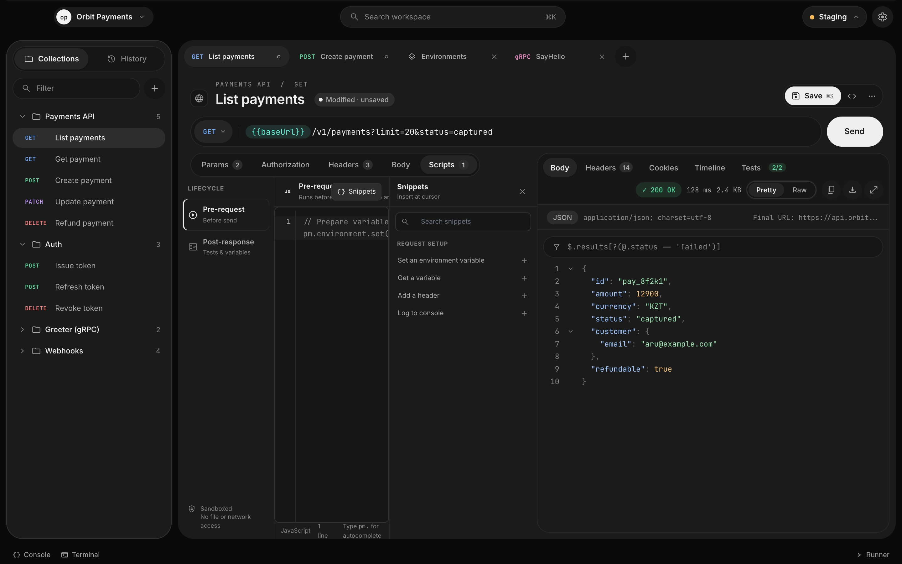
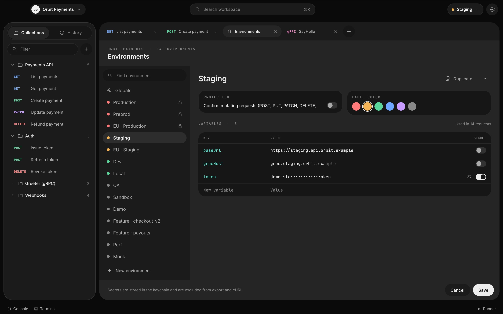

<div align="center">

[](https://nekidaz.github.io/.bonk/)

[](https://github.com/nekidaz/.bonk/releases/latest)
[](https://github.com/nekidaz/.bonk/releases)
[](LICENSE)


[**Download**](https://github.com/nekidaz/.bonk/releases/latest) · [**Website**](https://nekidaz.github.io/.bonk/) · [Features](#everything-for-the-request) · [AI / MCP](#your-ai-agent-now-speaks-api) · [Quick start](#your-first-request) · [Screenshots](#a-look-inside)

</div>

**Bonk is a native HTTP and gRPC client built in Rust.** Requests live as readable
files next to your code. Environments, scripts, a collection runner, and an
integrated MCP server turn that folder into an API workspace for you and your AI tools.

Open a directory and start sending requests. No account is required. Save a
request as `*.bonk.json`, review its changes in Git, and let an assistant work
with the same files. The desktop app uses Tauri and your OS WebView.

[](docs/landing/screenshots/hero.jpg)

## Install

### macOS · Apple Silicon

```sh
brew install --cask nekidaz/tap/bonk
```

Prefer a direct download? Get the `.dmg` from
[GitHub Releases](https://github.com/nekidaz/.bonk/releases/latest).
The app is not notarized by Apple; see the release's macOS installation notes
if Gatekeeper blocks first launch.

### Windows · x64

Download the Windows installer from
[GitHub Releases](https://github.com/nekidaz/.bonk/releases/latest) and run the setup wizard.

### Linux · x64

Download an `.AppImage` or `.deb` from
[GitHub Releases](https://github.com/nekidaz/.bonk/releases/latest).

```sh
# AppImage — from the download directory
chmod +x bonk_*.AppImage
./bonk_*.AppImage

# Debian / Ubuntu
sudo apt install ./bonk_*.deb
```

Use **Settings → Check for updates** for signed in-app updates, or
`brew upgrade --cask bonk` for Homebrew installations.

### Command line · `bonk run`

Run collections from a terminal or CI with the same scripts, variables and tests as
the app's Runner (`bonk run api --env Staging --junit report.xml`):

```sh
brew install nekidaz/tap/bonk
```

Or take `bonk-<platform>.tar.gz` / `.zip` from
[GitHub Releases](https://github.com/nekidaz/.bonk/releases/latest).

## Everything for the request

| Workflow | What you get |
| --- | --- |
| **HTTP & responses** | Query parameters, auth, headers, JSON/text/form/multipart/binary bodies, and GraphQL. Inspect formatted responses, cookies, timing, and size; search or filter JSON with JSONPath. |
| **gRPC** | Discover services with reflection or load `.proto` files. Call unary and streaming methods with metadata, deadlines, TLS/mTLS, message templates, and readable errors. |
| **Environments** | Reuse `{{variables}}`, globals, and named environments. Edit values inline, mark secrets, and require confirmation before requests to protected environments. |
| **Scripts & tests** | Sandboxed JavaScript pre-request and response scripts with familiar `pm.*` helpers, assertions, console output, and variable updates for HTTP and gRPC. |
| **Collection Runner** | Select and order requests, run iterations with CSV/JSON data, add delays, and stop on failure. Save presets, inspect run history, and export JSON reports. |
| **Flows** | Connect request, script, condition, loop, and delay blocks on a canvas. Pass payloads between steps and follow live status and output. |
| **Files & Git** | Organize nested request folders. Review diffs, stage files, commit, switch branches, and pull or push through system Git. |
| **Import & export** | Paste cURL, import Postman Collection v2.x or OpenAPI/Swagger, export collections, and generate language-specific request snippets. |
| **Desktop workflow** | Command palette, configurable shortcuts, history, terminal, console, resizable panes, themes, and English/Russian UI. |
| **AI / MCP** | One-click client setup, a standalone headless server, STDIO and Streamable HTTP, workspace permissions, network controls, and host allowlists. |

Bonk works offline for editing and organizing local work. API calls, update
checks, and Git remotes use the network. Postman import and `pm.*` helpers cover
supported workflows; they do not provide every Postman feature or script API.

## Your AI agent now speaks API

Bonk ships with its own **MCP server**. Claude Desktop, Claude Code, ChatGPT,
Codex, and other compatible clients can browse your workspace, build and save
requests, explore gRPC schemas, and execute API calls. The desktop app does
not need to stay open for a configured headless server to run.

> “Add POST /v1/refunds to Payments API and run it on staging.
> Take the token from the environment.”

The agent can discover the workspace, save the request alongside your other
files, and execute it with the selected environment. Its changes show up in
Bonk and in your Git diff.

### Connect a client

1. Open your workspace and go to **Settings → AI / MCP**.
2. Select the environment and choose whether to allow workspace edits and API calls.
3. Optionally restrict the hosts the server can contact.
4. Click **Install for all clients**, then restart the configured apps.

Bonk preserves unrelated client settings. **Remove from clients** removes its
integration entry. Local clients use STDIO; remote clients can connect through
Streamable HTTP at `/mcp`.

**You choose the permissions.** Read-only mode disables file edits; no-network
mode disables API calls; a host allowlist limits outbound targets. Environment
tokens provided through `BONK_VAR_*` can be injected into requests without
being shown to the model. Keys, cookies, and passwords are redacted by default.

[**MCP setup, configuration, and permissions →**](docs/MCP.md)

## Collections are just files

```text
payments-api/
├── payments/
│   ├── list-payments.bonk.json
│   └── create-payment.bonk.json
├── auth/
│   └── issue-token.bonk.json
└── grpc/
    └── say-hello.bonk.json
```

A saved HTTP request looks like this:

```json
{
  "name": "List payments",
  "protocol": "http",
  "request": {
    "method": "GET",
    "url": "{{baseUrl}}/v1/payments",
    "headers": {}
  }
}
```

Folders become collections. There is no collection manifest to keep in sync.
Keep requests in the same repository as the API, review changes in a pull
request, and share the directory with your team.

Collection auth can live in `.folder.bonk.json`. Preferences, history, and
session state live separately in the platform application-data directory.
Variables marked as secret use the OS keychain when available. Credentials
entered directly into a request can still be saved in its file; review files
before committing or sharing them.

## Your first request

1. **Open a folder.** An empty directory is enough.
2. **Create an HTTP request.** Enter your API URL, for example `http://localhost:8080/health`.
3. **Send it.** Inspect the status, body, headers, and timing.
4. **Save it.** Press `⌘S` on macOS or `Ctrl+S` on Windows/Linux and choose a collection folder.
5. **Reuse it.** Add an environment with `baseUrl = http://localhost:8080`, then set the URL to `{{baseUrl}}/health`.

Have requests already? Import a Postman/OpenAPI file or paste a cURL command
into the URL bar.

### Turn a response into a check

Add this in **Scripts → Tests**:

```javascript
pm.test("Service is healthy", () => {
  pm.expect(pm.response).to.have.status(200);
});
```

Send again and open the **Tests** response tab. To check a whole collection,
open **Runner**, choose the requests and environment, and start a run.

## A look inside

These screenshots show the current application with synthetic example data.

### gRPC — discover services and call methods

[](docs/landing/screenshots/grpc.jpg)

### Collection Runner — repeatable checks across your API

[](docs/landing/screenshots/runner.jpg)

<details>
<summary><strong>Scripts and response tests</strong></summary>

[](docs/landing/screenshots/scripts.jpg)

</details>

<details>
<summary><strong>Environments and reusable variables</strong></summary>

[](docs/landing/screenshots/environments.jpg)

</details>

## Feedback & releases

[**Report a bug or suggest a feature**](https://github.com/nekidaz/.bonk/issues) ·
[Changelog](CHANGELOG.md) · [Telegram](https://t.me/delayrat)

For bug reports, include your OS, Bonk version, and a minimal reproduction with
credentials removed.

## License

[MIT](LICENSE).

This repository hosts public downloads, documentation, and the landing page.
The application source is maintained separately.
