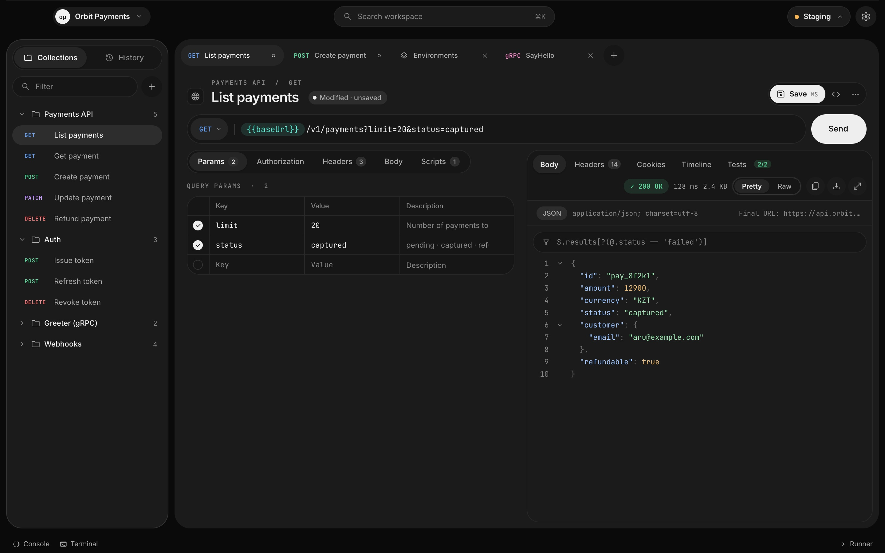

<div align="center">


# bonk

### Your API workflow. On your machine.

A local-first desktop client for **HTTP and gRPC**.<br />
Send requests, test collections, build flows, and connect your AI tools — in a workspace you own.

[](https://github.com/nekidaz/.bonk/releases/latest)
[](https://github.com/nekidaz/.bonk/releases)
[](LICENSE)


[**Download**](https://github.com/nekidaz/.bonk/releases/latest) · [**Website**](https://nekidaz.github.io/.bonk/) · [Features](#what-you-can-do) · [Quick start](#your-first-workspace) · [AI / MCP](#connect-your-ai-tools) · [Screenshots](#a-look-inside)

</div>


Bonk brings the API workflow onto your desktop: a request editor, a response
inspector, reusable environments, scripts, a collection runner, and a Flow
canvas. The request engine is Rust; the desktop shell is Tauri; the interface
is Svelte and TypeScript.

**Open a folder and start.** No account is required. Saved requests are readable
`*.bonk.json` files, and folders on disk are the collections in your sidebar.
Keep them beside your code, share them with a teammate, or review changes in Git.

## Why Bonk

- **A workspace you own.** Requests live in your selected directory, rather than
  requiring hosted collection storage.
- **Both protocols in one app.** HTTP and gRPC share environments, scripts,
  history, and collection workflows.
- **Native where it matters.** Rust handles requests and local operations;
  Tauri uses your OS WebView without bundling Chromium.
- **From debugging to repeatable checks.** Test a response, run a folder with
  iteration data, or connect requests on a Flow canvas.
- **AI can use the same workspace.** The bundled MCP server exposes requests,
  schemas, and execution with configurable permissions.

Bonk works offline for editing and organizing local work. API calls, update
checks, and Git remotes use the network.

## What you can do

| Area | Included workflows |
| --- | --- |
| **HTTP** | Query parameters, enabled/disabled headers, bearer/basic/API-key auth, collection auth inheritance, JSON/text/XML/HTML bodies, multipart files, URL-encoded forms, binary uploads, and GraphQL. |
| **Responses** | Pretty/raw views, syntax highlighting, headers, cookies, timing, response size, JSONPath filtering, folding, search, and request/response layouts including side by side and focus mode. |
| **gRPC** | Server reflection or local `.proto` files, searchable methods, message templates, metadata, unary and streaming calls, deadlines, TLS/mTLS settings, readable errors, and `grpcurl` snippets. |
| **Environments** | `{{variables}}`, globals, named environments, inline variable editing, secret values, and confirmation for protected environments. |
| **Scripts & tests** | Sandboxed JavaScript pre-request and response scripts, familiar `pm.*` helpers, assertions, console output, and variable updates for HTTP and gRPC. |
| **Collection Runner** | HTTP/gRPC collection runs, request selection and ordering, iterations, CSV/JSON data, delays, stop-on-failure, saved presets, run history, and JSON reports. |
| **Flows** | A node canvas with request, script, condition, loop, and delay blocks; payloads pass between steps, with live status and an output log. |
| **Files & Git** | Nested request folders, save/rename/duplicate/move, request diffs, staging, commits, branches, history, pull, and push via system Git. |
| **Import & export** | Paste cURL; import Postman Collection v2.x and OpenAPI/Swagger; export Postman/OpenAPI collections and language-specific request snippets. |
| **Desktop tools** | Searchable history, a command palette, configurable shortcuts, a terminal, console/issues panels, resizable panes, English/Russian UI, and editor-inspired themes. |
| **AI / MCP** | One-click setup for detected clients, a standalone headless server, STDIO and Streamable HTTP, read-only mode, network controls, and host allowlists. |
| **Updates** | In-app checks and installation of signed release updates. |

Import support and familiar `pm.*` helpers do not imply complete compatibility
with every Postman feature or script API.

## Install

[**Get the latest release →**](https://github.com/nekidaz/.bonk/releases/latest)

| Platform | Distribution |
| --- | --- |
| macOS · Apple Silicon | Homebrew cask or `.dmg` |
| Windows · x64 | Installer from GitHub Releases |
| Linux · x64 | `.AppImage` or `.deb` |

### macOS

```sh
brew install --cask nekidaz/tap/bonk
```

You can also download the Apple Silicon `.dmg`. The app is not notarized by
Apple; follow the macOS installation notes in the release if Gatekeeper blocks
first launch. Updater signatures and Apple notarization are separate mechanisms.

### Windows

Download the Windows installer from
[Releases](https://github.com/nekidaz/.bonk/releases/latest) and run the setup
wizard. The release assets list the currently available builds.

### Linux

For an AppImage, run these commands from the download directory:

```sh
chmod +x bonk_*.AppImage
./bonk_*.AppImage
```

For Debian or Ubuntu:

```sh
sudo apt install ./bonk_*.deb
```

**Updates:** use **Settings → Check for updates**, or upgrade the Homebrew cask
with `brew upgrade --cask bonk`.

## Your first workspace

1. **Open a folder** in Bonk. An empty directory is enough to start.
2. **Create an HTTP request** and enter a URL such as `http://localhost:8080/health`.
3. **Send it** and inspect the body, status, headers, and timing.
4. **Save the request** with `⌘S` on macOS or `Ctrl+S` on Windows/Linux. Choose a
   collection folder and name.
5. **Add an environment** with `baseUrl = http://localhost:8080`, then change
   the request URL to `{{baseUrl}}/health` to reuse it against other targets.

Already have a collection? Import a Postman or OpenAPI file. For a single
request, paste its cURL command into the URL bar.

### Add a response test

In the HTTP request's **Scripts → Tests** editor:

```javascript
pm.test("Service is healthy", () => {
  pm.expect(pm.response).to.have.status(200);
});
```

Send the request again and inspect the **Tests** response tab. To run checks
across a collection, open **Runner**, choose the requests and environment,
and start a run.

## A look inside

Screenshots show the current application UI with synthetic example data.
The displayed API targets, responses, and timings are illustrative.

| HTTP · request and response | gRPC · reflected methods and messages |
| --- | --- |
|  |  |

| Scripts · response assertions | Environments · reusable variables |
| --- | --- |
|  |  |

**Collection Runner** — configure and run repeatable checks across your requests.


## Your workspace is a directory

```text
my-api/
├── payments/
│   ├── list-payments.bonk.json
│   └── create-payment.bonk.json
├── auth/
│   └── issue-token.bonk.json
└── grpc/
    └── say-hello.bonk.json
```

Each request file contains its name, protocol, request options, and optional
parameters or gRPC configuration. For example:

```json
{
  "name": "List payments",
  "protocol": "http",
  "request": {
    "method": "GET",
    "url": "{{baseUrl}}/v1/payments",
    "headers": {}
  }
}
```

There is no collection manifest to keep in sync. Collection auth can be saved
in a folder's `.folder.bonk.json`. Preferences, history, and session state live
separately in the platform application-data directory. Variables marked as
secret use the OS keychain when available; request files can still contain
credentials you enter directly, so review them before committing or sharing.

## Connect your AI tools

Bonk includes a native **MCP server**, so compatible assistants can work with the
same request files you use in the app. The desktop app does not need to remain
open for a configured headless server to run.

1. Open the workspace you want to connect.
2. Go to **Settings → AI / MCP** and choose the environment and permissions.
3. Choose whether to allow workspace edits and API calls; optionally limit
   target hosts.
4. Click **Install for all clients** and restart the configured apps.

The server can inspect and edit requests, validate HTTP calls, explore gRPC
schemas, generate message templates, and execute saved requests. Local clients
use STDIO; remote clients can use Streamable HTTP at `/mcp`.

Existing unrelated client configuration is preserved. **Remove from clients**
removes Bonk's integration entry.

[**MCP setup and permissions guide →**](docs/MCP.md)

## Feedback & releases

Found a problem or have a feature request? [Open an issue](https://github.com/nekidaz/.bonk/issues)
and include your OS, Bonk version, and a minimal reproduction with credentials
removed. For release history, see [CHANGELOG.md](CHANGELOG.md).

## License

[MIT](LICENSE).

This repository hosts public downloads, documentation, and the landing page.
The application source is maintained separately.
